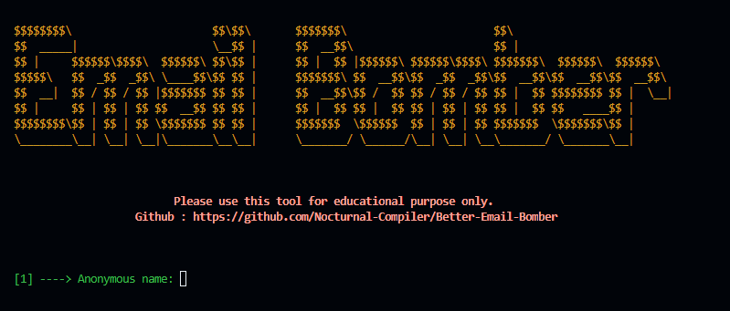
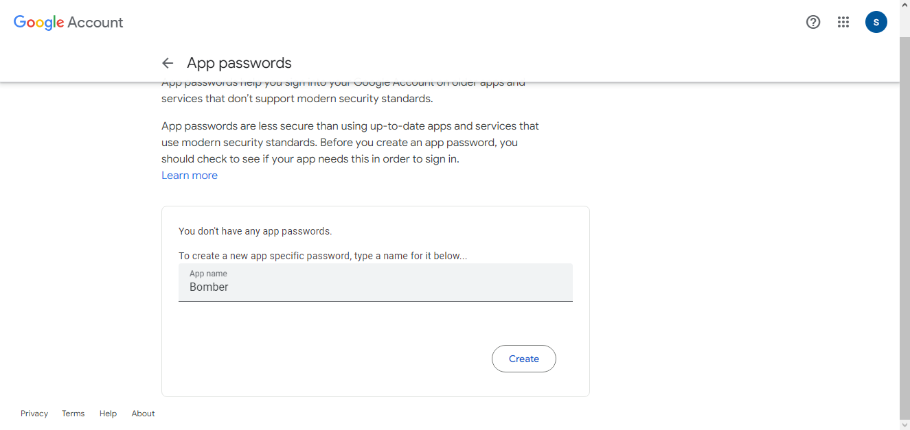
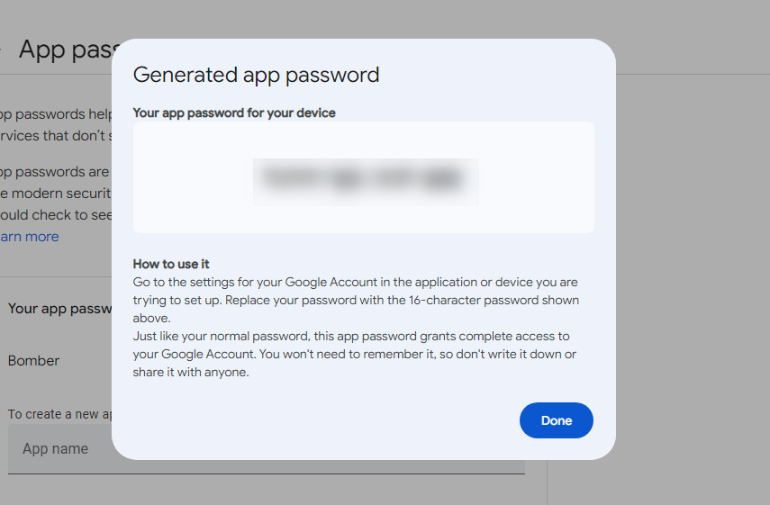

# Better-Email-Bomber




A better styled and simpler version of the email bomber program which doesn't compromises in style, functionality or performance.

## Table of Contents
- [Installation](#installation)
- [Getting the App Password](#getting-the-app-password)
- [Usage](#usage)
- [Credits](#credits)

## Installation
```
git clone https://github.com/Nocturnal-Compiler/Better-Email-Bomber.git
```
Or you can just normally download the code
```
pip install simple_chalk
```
To run the program:
```
python bomber.py
```
## Getting the App Password

go to https://myaccount.google.com/apppasswords to get an app password to your email from which you want to send emails

1. ### Creating a App Name


2. ### Copying The Password


Use this password as the email password in the program

## Roadmap
- Will add functionality of other mail services in the next release

## Usage
Should be used for educational purposes only, Use at your own risk, I do not stand responsible with what you do with this tool

## Credits
Credits to [Omicrons](https://github.com/mohinparamasivam/Email-Bomber) Rewrite of the code for python 3.8